# Database Documentation

[](#) [](#)

## Overview

This document provides comprehensive documentation for the MENSA website database structure. The database is built using **MySQL** with **Laravel Framework** migrations and Eloquent ORM.

## Table of Contents

-   [Version History](#version-history)
-   [Database Configuration](#database-configuration)
-   [Entity Relationship Diagram (ERD)](#entity-relationship-diagram-erd)
-   [Database Tables](#database-tables)
-   [Key Relationships](#key-relationships)
-   [Migrations](#migrations)
-   [Seeders](#seeders)
-   [Factories](#factories)
-   [Important Notes for Backend Developers](#important-notes-for-backend-developers)

---

## Version History

| Date             | Description     |
| ---------------- | --------------- |
| October 30, 2025 | Initial Version |

---

## Database Configuration

### Connection Details

The database uses MySQL with the following configuration (from `config/database.php`):

```php
'default' => env('DB_CONNECTION', 'mysql'),

'connections' => [
    'mysql' => [
        'driver' => env('DB_CONNECTION'),
        'host' => env('DB_HOST'),
        'port' => env('DB_PORT'),
        'database' => env('DB_DATABASE'),
        'username' => env('DB_USERNAME'),
        'password' => env('DB_PASSWORD'),
        'charset' => 'utf8mb4',
        'collation' => 'utf8mb4_unicode_ci',
    ],
],
```

### Docker Configuration

The database runs in a Docker container with the following setup (from `docker-compose.yml`):

```yaml
mysql:
    image: mysql:8.0.31
    command: --sql-mode="NO_ENGINE_SUBSTITUTION" --character-set-server=utf8mb4 --collation-server=utf8mb4_unicode_ci
    ports:
        - "3306:3306"
    environment:
        MYSQL_DATABASE: mensa
        MYSQL_ROOT_PASSWORD: password
```

---

## Entity Relationship Diagram (ERD)

The following diagram illustrates the relationships between the main entities in the database (please use a Mermaid-compatible viewer to visualize):

```mermaid
erDiagram
    %% Core User Management
    users ||--o{ user_has_contacts : has
    users ||--|| members : "can be"
    users }o--|| genders : belongs_to
    users }o--|| passport_types : belongs_to
    users ||--o{ user_login_logs : has
    users ||--o{ admission_test_orders : creates
    users ||--o{ contact_has_verifications : creates
    users ||--o{ reset_password_logs : has
    users ||--o{ sessions : has

    %% User Contacts
    user_has_contacts ||--o{ contact_has_verifications : has

    %% Member & Address
    members }o--|| addresses : has
    addresses }o--|| districts : located_in
    districts }o--|| areas : belongs_to

    %% Admission Tests
    admission_tests }o--|| admission_test_types : has_type
    admission_tests }o--o| locations : held_at
    admission_tests }o--o| addresses : held_at
    admission_tests ||--o{ admission_test_has_candidate : has
    admission_tests ||--o{ admission_test_has_proctor : has

    %% Admission Test Relations
    admission_test_has_candidate }o--|| users : candidate
    admission_test_has_candidate }o--o| admission_test_orders : paid_via
    admission_test_has_proctor }o--|| users : proctor

    %% Payment & Products
    admission_test_orders }o--|| users : ordered_by
    admission_test_orders }o--|| stripe_customers : "via (polymorphic)"
    admission_test_orders }o--|| other_payment_gateways : "via (polymorphic)"
    admission_test_products ||--o{ admission_test_prices : has

    %% Stripe Integration
    stripe_customers }o--|| users : "for (polymorphic)"

    %% Permission System (Spatie)
    permissions }o--|| modules : belongs_to
    permissions }o--|| permissions : parent
    roles }o--o| teams : belongs_to
    roles }o--o| roles : parent

    teams }o--|| team_types : has_type

    %% Permission Pivot Tables
    users }o--o{ permissions : model_has_permissions
    users }o--o{ roles : model_has_roles
    roles }o--o{ permissions : role_has_permissions
    teams }o--o{ roles : team_roles
    modules }o--o{ permissions : module_permissions

    %% CMS & Navigation
    site_pages ||--o{ site_contents : has
    navigation_items }o--o| navigation_items : parent
    custom_web_pages

    %% System Tables
    cache
    cache_locks
    jobs
    job_batches
    failed_jobs
    personal_access_tokens
    migrations

    %% Entity Definitions
    users {
        bigint id PK
        string username UK
        string password
        string family_name
        string middle_name
        string given_name
        bigint gender_id FK
        bigint passport_type_id FK
        string passport_number
        date birthday
        boolean synced_to_stripe
        timestamp created_at
        timestamp updated_at
    }

    members {
        bigint id PK
        bigint user_id FK
        boolean is_active
        date expired_on
        date actual_expired_on
        string prefix_name
        string nickname
        string suffix_name
        string address_id FK
        string forward_email UK
        timestamp created_at
        timestamp updated_at
    }

    user_has_contacts {
        bigint id PK
        bigint user_id FK
        enum type
        string contact
        boolean is_default
        timestamp created_at
        timestamp updated_at
    }

    addresses {
        bigint id PK
        bigint district_id FK
        string address
        timestamp created_at
        timestamp updated_at
    }

    districts {
        bigint id PK
        bigint area_id FK
        string name
        bigint display_order
        timestamp created_at
        timestamp updated_at
    }

    areas {
        bigint id PK
        string name UK
        bigint display_order
        timestamp created_at
        timestamp updated_at
    }

    admission_tests {
        bigint id PK
        bigint type_id FK
        datetime testing_at
        datetime expect_end_at
        bigint location_id FK
        bigint address_id FK
        int maximum_candidates
        boolean is_public
        timestamp created_at
        timestamp updated_at
    }

    admission_test_types {
        bigint id PK
        string name
        tinyint interval_month
        boolean is_active
        boolean display_order
        timestamp created_at
        timestamp updated_at
    }

    admission_test_has_candidate {
        bigint id PK
        bigint test_id FK
        bigint user_id FK
        bigint order_id FK
        boolean is_present
        boolean is_pass
        timestamp created_at
        timestamp updated_at
    }

    admission_test_has_proctor {
        bigint id PK
        bigint test_id FK
        bigint user_id FK
        timestamp created_at
        timestamp updated_at
    }

    admission_test_orders {
        bigint id PK
        bigint user_id FK
        string product_name
        string price_name
        smallint price
        tinyint quota
        enum status
        datetime expired_at
        string gatewayable_type
        bigint gatewayable_id
        string reference_number
        timestamp created_at
        timestamp updated_at
    }

    admission_test_products {
        bigint id PK
        string name
        string option_name
        tinyint minimum_age
        tinyint maximum_age
        datetime start_at
        datetime end_at
        tinyint quota
        string stripe_id
        boolean synced_to_stripe
        timestamp created_at
        timestamp updated_at
    }

    admission_test_prices {
        bigint id PK
        bigint product_id FK
        string name
        smallint price
        datetime start_at
        string stripe_id
        boolean synced_to_stripe
        timestamp created_at
        timestamp updated_at
    }

    stripe_customers {
        string id PK
        string customerable_type
        bigint customerable_id
        timestamp created_at
        timestamp updated_at
    }

    other_payment_gateways {
        bigint id PK
        string name
        boolean is_active
        bigint display_order
        timestamp created_at
        timestamp updated_at
    }

    genders {
        bigint id PK
        string name
        timestamp created_at
        timestamp updated_at
    }

    passport_types {
        bigint id PK
        string name
        timestamp created_at
        timestamp updated_at
    }

    locations {
        bigint id PK
        string name UK
        timestamp created_at
        timestamp updated_at
    }

    permissions {
        bigint id PK
        string name UK
        bigint module_id FK
        bigint permission_id FK
        string guard_name
        timestamp created_at
        timestamp updated_at
    }

    roles {
        bigint id PK
        string name
        bigint team_id FK
        bigint role_id FK
        bigint display_order
        string guard_name
        timestamp created_at
        timestamp updated_at
    }

    modules {
        bigint id PK
        string name UK
        string title
        bigint display_order
        timestamp created_at
        timestamp updated_at
    }

    teams {
        bigint id PK
        string name
        bigint type_id FK
        bigint display_order
        timestamp created_at
        timestamp updated_at
    }

    team_types {
        bigint id PK
        string name UK
        string title
        bigint display_order
        timestamp created_at
        timestamp updated_at
    }

    site_pages {
        bigint id PK
        string name
        timestamp created_at
        timestamp updated_at
    }

    site_contents {
        bigint id PK
        bigint page_id FK
        string name
        text content
        timestamp created_at
        timestamp updated_at
    }

    custom_web_pages {
        bigint id PK
        string pathname UK
        string title
        string og_image_url
        string description
        mediumtext content
        timestamp created_at
        timestamp updated_at
    }

    navigation_items {
        bigint id PK
        bigint master_id FK
        string name
        string url
        bigint display_order
        timestamp created_at
        timestamp updated_at
    }

    contact_has_verifications {
        bigint id PK
        bigint contact_id FK
        string contact
        enum type
        string code
        tinyint tried_time
        datetime closed_at
        datetime verified_at
        datetime expired_at
        bigint creator_id FK
        string creator_ip
        boolean middleware_should_count
        timestamp created_at
        timestamp updated_at
    }

    reset_password_logs {
        bigint id PK
        bigint passport_type_id FK
        string passport_number
        bigint user_id FK
        enum contact_type
        bigint creator_id FK
        string creator_ip
        boolean middleware_should_count
        timestamp created_at
        timestamp updated_at
    }

    user_login_logs {
        bigint id PK
        bigint user_id FK
        boolean status
        timestamp created_at
        timestamp updated_at
    }

    sessions {
        string id PK
        bigint user_id FK
        string ip_address
        text user_agent
        longtext payload
        int last_activity
    }
```



---

## Database Tables

### 1. Core User Management

#### `users`

Primary user table storing user account information.

**Columns:**

-   `id` - Primary key
-   `username` - Unique username (max 320 chars)
-   `password` - Hashed password
-   `family_name`, `middle_name`, `given_name` - User's full name
-   `gender_id` - Foreign key to `genders` table
-   `passport_type_id` - Foreign key to `passport_types` table
-   `passport_number` - User's identification number
-   `birthday` - Date of birth
-   `synced_to_stripe` - Boolean flag for Stripe integration

**Relationships:**

-   `belongsTo`: Gender, PassportType
-   `hasMany`: UserHasContact, UserLoginLog, AdmissionTestOrder
-   `hasOne`: Member
-   `belongsToMany`: AdmissionTest (via proctors/candidates), Permissions, Roles

#### `members`

Extended profile for active MENSA members.

**Special Note:** Uses custom ID generation with `DB::raw('(SELECT IFNULL(MAX(id), 0)+1 FROM members temp)')` on creation.

**Columns:**

-   `id` - Primary key (non-incrementing, custom generation)
-   `user_id` - Foreign key to users
-   `is_active` - Membership status
-   `expired_on` - Membership expiration date
-   `actual_expired_on` - Actual expiration considering extensions
-   `forward_email` - Unique forwarding email address

#### `user_has_contacts`

Stores multiple contact methods (email/mobile) for users.

**Columns:**

-   `type` - ENUM('email', 'mobile')
-   `contact` - Contact information (max 320 chars)
-   `is_default` - Boolean flag for default contact

#### `sessions`

Laravel session storage.

#### `user_login_logs`

Tracks user login attempts and status.

### 2. Location & Address System

#### `areas`

Top-level geographic regions.

**Columns:**

-   `name` - Unique area name
-   `display_order` - Sorting order

#### `districts`

Districts within areas.

**Unique Constraint:** (`area_id`, `name`)

#### `addresses`

Specific addresses linked to districts.

**Unique Constraint:** (`district_id`, `address`)

#### `locations`

Named locations for admission tests (e.g., "Main Campus", "Downtown Center").

### 3. Admission Test System

#### `admission_tests`

Main table for admission test events.

**Columns:**

-   `type_id` - Foreign key to `admission_test_types`
-   `testing_at` - Test start datetime
-   `expect_end_at` - Expected end datetime
-   `location_id` - Physical location
-   `address_id` - Specific address
-   `maximum_candidates` - Capacity limit
-   `is_public` - Visibility flag

**Relationships:**

-   `belongsTo`: AdmissionTestType, Location, Address
-   `belongsToMany`: User (via candidates/proctors)

#### `admission_test_types`

Categories of admission tests.

**Columns:**

-   `interval_month` - Minimum months between retakes
-   `is_active` - Whether this test type is currently offered

#### `admission_test_has_candidate`

Pivot table linking users as test candidates.

**Columns:**

-   `is_present` - Attendance tracking
-   `is_pass` - Test result (nullable until graded)
-   `order_id` - Link to payment order

**Foreign Key Constraint:** `ON DELETE CASCADE` for `test_id`

#### `admission_test_has_proctor`

Pivot table linking users as test proctors.

**Foreign Key Constraint:** `ON DELETE CASCADE` for `test_id`

### 4. Payment & E-Commerce

#### `admission_test_orders`

Payment orders for admission tests.

**Columns:**

-   `status` - ENUM('pending', 'cancelled', 'failed', 'expired', 'succeeded')
-   `price` - Amount in smallest currency unit
-   `quota` - Number of test attempts (default: 2)
-   `gatewayable_type`, `gatewayable_id` - Polymorphic relation to payment gateway
-   `reference_number` - External transaction reference

**Polymorphic Relationship:** Can relate to `StripeCustomer` or `OtherPaymentGateway`

#### `admission_test_products`

Products representing test packages.

**Columns:**

-   `minimum_age`, `maximum_age` - Age eligibility
-   `start_at`, `end_at` - Product availability period
-   `quota` - Default number of attempts
-   `stripe_id` - Stripe product ID
-   `synced_to_stripe` - Sync status

#### `admission_test_prices`

Pricing tiers for products (time-based pricing).

**Columns:**

-   `product_id` - Foreign key to products
-   `price` - Price in smallest currency unit
-   `start_at` - When this price becomes active
-   `stripe_id` - Stripe price ID

#### `stripe_customers`

Polymorphic table for Stripe customer mappings.

**Polymorphic Relationship:** Can relate to any model (typically User)

#### `other_payment_gateways`

Configuration for alternative payment methods.

### 5. Permission & Role System (Spatie Laravel Permission)

The application uses [Spatie Laravel Permission](https://spatie.be/docs/laravel-permission) package.

#### `permissions`

Individual permissions.

**Columns:**

-   `name` - Unique permission name
-   `module_id` - Grouping by module
-   `permission_id` - Parent permission (hierarchical)
-   `guard_name` - Authentication guard (default: 'web')

**Unique Constraint:** (`name`, `guard_name`)

#### `roles`

User roles within teams.

**Columns:**

-   `team_id` - Optional team scope
-   `role_id` - Parent role (hierarchical)
-   `display_order` - Sorting order
-   `guard_name` - Authentication guard

#### `modules`

Module groupings for permissions.

#### `teams`

Organizational teams.

**Unique Constraint:** (`name`, `type_id`)

#### `team_types`

Categories of teams.

#### Pivot Tables:

-   `model_has_permissions` - Polymorphic: User/Model → Permissions
-   `model_has_roles` - Polymorphic: User/Model → Roles
-   `role_has_permissions` - Role → Permissions
-   `team_roles` - Team → Roles (custom)
-   `module_permissions` - Module → Permissions (custom)

### 6. CMS & Content Management

#### `site_pages`

Pages in the CMS system.

#### `site_contents`

Content blocks within pages.

#### `custom_web_pages`

Custom pages with SEO optimization.

**Columns:**

-   `pathname` - Unique URL path (max 768 chars for unique index)
-   `title` - SEO title (max 60 chars)
-   `description` - Meta description (max 65 chars)
-   `og_image_url` - Open Graph image
-   `content` - Page content (mediumtext)

#### `navigation_items`

Hierarchical navigation menu items.

**Self-Referencing:** `master_id` can reference another `navigation_items.id`

**Foreign Key Constraint:** `ON DELETE CASCADE` for `master_id`

### 7. Security & Verification

#### `contact_has_verifications`

Email/mobile verification codes.

**Columns:**

-   `contact_id` - Foreign key to `user_has_contacts`
-   `code` - Verification code
-   `tried_time` - Number of verification attempts
-   `closed_at`, `verified_at`, `expired_at` - Status timestamps
-   `creator_id` - User who initiated verification
-   `creator_ip` - IP address of requester
-   `middleware_should_count` - Rate limiting flag

#### `reset_password_logs`

Password reset attempt tracking.

#### `personal_access_tokens`

Laravel Sanctum API tokens.

**Polymorphic Relationship:** Belongs to any tokenable model (typically User)

### 8. System Tables

#### `cache` & `cache_locks`

Laravel cache system tables.

#### `jobs`, `job_batches`, `failed_jobs`

Laravel queue system tables.

**Columns in `jobs`:**

-   `queue` - Queue name
-   `payload` - Serialized job data
-   `attempts` - Number of attempts
-   `available_at` - When job becomes available

#### `migrations`

Laravel migration tracking table.

---

## Key Relationships

### User Ecosystem

```
User
  ├─ hasMany: UserHasContact
  ├─ hasMany: UserLoginLog
  ├─ hasMany: AdmissionTestOrder
  ├─ hasOne: Member
  ├─ belongsTo: Gender
  ├─ belongsTo: PassportType
  └─ belongsToMany: AdmissionTest (as candidate/proctor)
```

### Admission Test Ecosystem

```
AdmissionTest
  ├─ belongsTo: AdmissionTestType
  ├─ belongsTo: Location
  ├─ belongsTo: Address
  ├─ belongsToMany: User (candidates) via admission_test_has_candidate
  └─ belongsToMany: User (proctors) via admission_test_has_proctor

AdmissionTestProduct
  └─ hasMany: AdmissionTestPrice
```

### Location Hierarchy

```
Area
  └─ hasMany: District
      └─ hasMany: Address
          ├─ hasMany: AdmissionTest
          └─ hasMany: Member
```

### Permission System

```
Module
  └─ hasMany: Permission
      └─ belongsToMany: Role

Team
  ├─ belongsTo: TeamType
  └─ belongsToMany: Role

User
  ├─ hasMany: Permission (via model_has_permissions)
  └─ hasMany: Role (via model_has_roles)
```

---

## Migrations

### Migration Execution Order

Migrations are executed in chronological order by filename. Key milestones:

1. **Core System** (0001*01_01*\*): Cache, Jobs, Users, Sessions
2. **Authentication** (2019*12_14*\*): Personal Access Tokens
3. **User System** (2024*09*\*): Genders, Passport Types, User Contacts
4. **Permission System** (2024*12_29*\*): Modules, Permissions, Roles, Teams
5. **Member System** (2025*01_22*\*): Members, Areas, Districts, Addresses
6. **Admission Tests** (2025*01_22*_ - 2025*04*_): Tests, Products, Prices
7. **Payment System** (2025*05*\*): Stripe, Other Gateways
8. **Order System** (2025*09_05*\*): Admission Test Orders

### Running Migrations

```bash
# Run all pending migrations
php artisan migrate

# Rollback last migration batch
php artisan migrate:rollback

# Reset and re-run all migrations
php artisan migrate:fresh

# Reset and run with seeders
php artisan migrate:fresh --seed
```

### Migration Seeders

Some migrations automatically run seeders:

-   `2024_09_16_133353_run_gender_seeder.php`
-   `2024_09_16_133421_run_passport_type_seeder.php`
-   `2024_12_29_205019_run_team_role_seeder.php`
-   `2024_12_29_222606_run_module_seeder.php`
-   `2025_01_23_162413_run_area_district_seeder.php`
-   `2025_03_06_234103_run_site_content_seeder.php`
-   `2025_05_30_155259_run_other_payment_gateway_seeder.php`

---

## Seeders

Located in `database/seeders/`:

### Available Seeders

1. **DatabaseSeeder.php** - Main seeder (currently empty, add your test data here)
2. **GenderSeeder.php** - Populates gender options
3. **PassportTypeSeeder.php** - Populates passport/ID types
4. **AreaDistrictSeeder.php** - Populates areas and districts
5. **ModuleSeeder.php** - Populates permission modules
6. **TeamRoleSeeder.php** - Sets up initial team roles
7. **SiteContentSeeder.php** - Populates default site content
8. **OtherPaymentGatewaySeeder.php** - Configures payment gateways
9. **SuperAdministratorSeeder.php** - Creates super admin account

### Running Seeders

```bash
# Run all seeders
php artisan db:seed

# Run specific seeder
php artisan db:seed --class=GenderSeeder

# Fresh migration with seeding
php artisan migrate:fresh --seed
```

---

## Factories

Located in `database/factories/`:

Factories are available for testing and development data generation:

-   `UserFactory.php`
-   `AddressFactory.php`
-   `AdmissionTestFactory.php`
-   `AdmissionTestOrderFactory.php`
-   `AdmissionTestPriceFactory.php`
-   `AdmissionTestProductFactory.php`
-   `AdmissionTestTypeFactory.php`
-   `CustomWebPageFactory.php`
-   `LocationFactory.php`
-   `NavigationItemFactory.php`
-   `OtherPaymentGatewayFactory.php`
-   `UserHasContactFactory.php`

### Using Factories

```php
// Create a single user
$user = User::factory()->create();

// Create multiple users
$users = User::factory()->count(10)->create();

// Create user with specific attributes
$user = User::factory()->create([
    'username' => 'testuser@example.com',
    'family_name' => 'Doe',
]);

// Create related models
$user = User::factory()
    ->has(UserHasContact::factory()->count(2))
    ->create();
```

---

## Important Notes for Backend Developers

### 1. Database Charset & Collation

**Always use UTF-8MB4:**

-   Charset: `utf8mb4`
-   Collation: `utf8mb4_unicode_ci`

This supports full Unicode including emojis and special characters.

### 2. Foreign Key Constraints

Many tables use foreign key constraints with `ON DELETE CASCADE`:

-   `admission_test_has_candidate` → `admission_tests`
-   `admission_test_has_proctor` → `admission_tests`
-   `navigation_items` → `navigation_items` (self-reference)

**Important:** Be careful when deleting parent records as related records will be automatically deleted.

### 3. Polymorphic Relationships

Two polymorphic implementations:

#### a) Stripe Customers (Type + ID)

```php
// In admission_test_orders:
'gatewayable_type' => 'App\Models\StripeCustomer'
'gatewayable_id' => 123

// In stripe_customers:
'customerable_type' => 'App\Models\User'
'customerable_id' => 456
```

#### b) Personal Access Tokens

```php
'tokenable_type' => 'App\Models\User'
'tokenable_id' => 123
```

### 4. Enum Fields

Several tables use ENUM fields. Update carefully:

-   `user_has_contacts.type`: `['email', 'mobile']`
-   `contact_has_verifications.type`: `['email', 'mobile']`
-   `admission_test_orders.status`: `['pending', 'cancelled', 'failed', 'expired', 'succeeded']`
-   `reset_password_logs.contact_type`: `['email', 'mobile']`

### 5. Unique Constraints

**Composite Unique Constraints:**

-   `addresses`: (`district_id`, `address`)
-   `districts`: (`area_id`, `name`)
-   `teams`: (`name`, `type_id`)

**Single Column Unique:**

-   `users.username`
-   `users.forward_email`
-   `areas.name`
-   `locations.name`
-   `custom_web_pages.pathname`

### 6. Custom ID Generation

The `members` table uses custom ID generation:

```php
protected static function booted(): void
{
    static::creating(function (Member $member) {
        $member->id = DB::raw('(SELECT IFNULL(MAX(id), 0)+1 FROM members temp)');
    });
}
```

**Note:** This is not auto-increment. Handle with care in concurrent environments.

### 7. Stripe Integration

Tables with Stripe integration fields:

-   `users.synced_to_stripe`
-   `admission_test_products.stripe_id` & `synced_to_stripe`
-   `admission_test_prices.stripe_id` & `synced_to_stripe`
-   `stripe_customers` (dedicated table)

**Always check sync status before making Stripe API calls.**

### 8. Soft Deletes

**Currently NOT implemented** in any table. If you need soft deletes:

```php
use Illuminate\Database\Eloquent\SoftDeletes;

class YourModel extends Model
{
    use SoftDeletes;
}
```

Then add migration:

```php
$table->softDeletes();
```

### 9. Timestamps

All tables use Laravel timestamps (`created_at`, `updated_at`) except:

-   `cache`, `cache_locks`
-   `jobs`, `failed_jobs`
-   `sessions`

### 10. Queue System

The application uses database queues:

-   `jobs` - Pending jobs
-   `job_batches` - Batch job tracking
-   `failed_jobs` - Failed job records

**Run queue worker:**

```bash
php artisan queue:work
```

### 11. Testing Database

Use separate testing database or in-memory SQLite:

```php
// phpunit.xml
<env name="DB_CONNECTION" value="sqlite"/>
<env name="DB_DATABASE" value=":memory:"/>
```

### 12. Performance Considerations

#### Indexes

Key indexed columns (ensure indexes exist):

-   All foreign keys
-   `users.username`
-   `users.passport_number`
-   `user_has_contacts.contact`
-   `admission_tests.testing_at`
-   `sessions.last_activity`

#### Query Optimization

-   Use eager loading to avoid N+1 queries:
    ```php
    $users = User::with(['contacts', 'member.address.district.area'])->get();
    ```
-   Use `select()` to limit columns:
    ```php
    User::select('id', 'username', 'family_name')->get();
    ```

### 13. Security Best Practices

#### Mass Assignment Protection

All models should define `$fillable` or `$guarded`:

```php
protected $fillable = ['field1', 'field2'];
// OR
protected $guarded = ['id', 'created_at', 'updated_at'];
```

#### Password Hashing

Always hash passwords:

```php
use Illuminate\Support\Facades\Hash;

$user->password = Hash::make($plainPassword);
```

#### SQL Injection Prevention

Use parameter binding:

```php
// Good
DB::table('users')->where('email', $email)->get();

// Bad
DB::select("SELECT * FROM users WHERE email = '$email'");
```

### 14. Database Rebuild Script

Use the provided script:

```bash
./db_rebuild.sh
```

This script should handle dropping and recreating the database with migrations and seeds.

### 15. Spatie Laravel Permission

The system uses Spatie's permission package. Key points:

-   **Cache:** Permission checks are cached. Clear cache after permission changes:

    ```bash
    php artisan permission:cache-reset
    ```

-   **Usage in code:**

    ```php
    // Assign role
    $user->assignRole('admin');

    // Check permission
    if ($user->can('edit articles')) {
        // ...
    }

    // In Blade
    @can('edit articles')
        <!-- ... -->
    @endcan
    ```

-   **Team-scoped permissions:** The system implements team-based permissions through custom pivot tables.

### 16. Common Queries

```php
// Get active members with addresses
$members = Member::with('address.district.area')
    ->where('is_active', true)
    ->get();

// Get upcoming admission tests
$tests = AdmissionTest::with(['type', 'location', 'address'])
    ->where('testing_at', '>', now())
    ->where('is_public', true)
    ->get();

// Get user's test orders
$orders = AdmissionTestOrder::with('gatewayable')
    ->where('user_id', $userId)
    ->where('status', 'succeeded')
    ->get();

// Get test candidates
$candidates = AdmissionTest::find($testId)
    ->candidates()
    ->withPivot(['is_present', 'is_pass'])
    ->get();
```

---

## Troubleshooting

### Common Issues

1. **Migration fails with foreign key constraint error**

    - Check migration execution order
    - Ensure referenced tables exist before creating foreign keys
    - Verify data types match between foreign key columns

---

## Additional Resources for Reference

-   (TODO)

---

## Contributing

When adding new migrations:

1. Follow Laravel naming conventions: `YYYY_MM_DD_HHMMSS_create_table_name.php`
2. Include both `up()` and `down()` methods
3. Add foreign key constraints where appropriate
4. Update this README with new table documentation
5. Create corresponding factory if needed for testing

---

<span style="color: red;">**This documentation is manually maintained. Please ensure accuracy when making changes to the database schema. For questions or clarifications, please contact the development team.**</span>
