# 數據庫文檔 (中文繁體版)

[](#) [](#)

## 概覽

本文檔提供了 MENSA 網站數據庫結構的綜合文檔。數據庫使用 **MySQL** 並結合 **Laravel 框架**的遷移和 Eloquent ORM 進行構建。

> 🚨 本文檔基於`database/README.md`的英文版本翻譯而成，旨在為中文繁體用戶提供清晰的數據庫結構說明。如有任何歧義或需要澄清之處，請以英文版本為準，並聯繫開發團隊。

## 目錄

-   [版本歷史](#版本歷史)
-   [數據庫配置](#數據庫配置)
-   [實體關係圖（ERD）](#實體關係圖erd)
-   [數據庫表](#數據庫表)
-   [主要關係](#主要關係)
-   [遷移](#遷移)
-   [數據種子](#數據種子)
-   [工廠](#工廠)
-   [後端開發人員重要說明](#後端開發人員重要說明)

---

## 版本歷史

| 日期                | 描述     |
| ------------------- | -------- |
| 2025 年 10 月 30 日 | 初始版本 |

---

## 數據庫配置

### 連接詳情

數據庫使用 MySQL，配置如下（來自 `config/database.php`）：

```php
'default' => env('DB_CONNECTION', 'mysql'),

'connections' => [
    'mysql' => [
        'driver' => env('DB_CONNECTION'),
        'host' => env('DB_HOST'),
        'port' => env('DB_PORT'),
        'database' => env('DB_DATABASE'),
        'username' => env('DB_USERNAME'),
        'password' => env('DB_PASSWORD'),
        'charset' => 'utf8mb4',
        'collation' => 'utf8mb4_unicode_ci',
    ],
],
```

### Docker 配置

數據庫運行在 Docker 容器中，設置如下（來自 `docker-compose.yml`）：

```yaml
mysql:
    image: mysql:8.0.31
    command: --sql-mode="NO_ENGINE_SUBSTITUTION" --character-set-server=utf8mb4 --collation-server=utf8mb4_unicode_ci
    ports:
        - "3306:3306"
    environment:
        MYSQL_DATABASE: mensa
        MYSQL_ROOT_PASSWORD: password
```

---

## 實體關係圖（ERD）

下圖展示了數據庫中主要實體之間的關係（請使用 Mermaid 兼容的查看器來查看）：

```mermaid
erDiagram
    %% 核心用戶管理
    users ||--o{ user_has_contacts : has
    users ||--|| members : "can be"
    users }o--|| genders : belongs_to
    users }o--|| passport_types : belongs_to
    users ||--o{ user_login_logs : has
    users ||--o{ admission_test_orders : creates
    users ||--o{ contact_has_verifications : creates
    users ||--o{ reset_password_logs : has
    users ||--o{ sessions : has

    %% 用戶聯繫方式
    user_has_contacts ||--o{ contact_has_verifications : has

    %% 成員與地址
    members }o--|| addresses : has
    addresses }o--|| districts : located_in
    districts }o--|| areas : belongs_to

    %% 資格試
    admission_tests }o--|| admission_test_types : has_type
    admission_tests }o--o| locations : held_at
    admission_tests }o--o| addresses : held_at
    admission_tests ||--o{ admission_test_has_candidate : has
    admission_tests ||--o{ admission_test_has_proctor : has

    %% 資格試關係
    admission_test_has_candidate }o--|| users : candidate
    admission_test_has_candidate }o--o| admission_test_orders : paid_via
    admission_test_has_proctor }o--|| users : proctor

    %% 支付與產品
    admission_test_orders }o--|| users : ordered_by
    admission_test_orders }o--|| stripe_customers : "via (polymorphic)"
    admission_test_orders }o--|| other_payment_gateways : "via (polymorphic)"
    admission_test_products ||--o{ admission_test_prices : has

    %% Stripe 集成
    stripe_customers }o--|| users : "for (polymorphic)"

    %% 權限系統（Spatie）
    permissions }o--|| modules : belongs_to
    permissions }o--|| permissions : parent
    roles }o--o| teams : belongs_to
    roles }o--o| roles : parent

    teams }o--|| team_types : has_type

    %% 權限樞紐表
    users }o--o{ permissions : model_has_permissions
    users }o--o{ roles : model_has_roles
    roles }o--o{ permissions : role_has_permissions
    teams }o--o{ roles : team_roles
    modules }o--o{ permissions : module_permissions

    %% CMS 與導航
    site_pages ||--o{ site_contents : has
    navigation_items }o--o| navigation_items : parent
    custom_web_pages

    %% 系統表
    cache
    cache_locks
    jobs
    job_batches
    failed_jobs
    personal_access_tokens
    migrations

    %% 實體定義
    users {
        bigint id PK
        string username UK
        string password
        string family_name
        string middle_name
        string given_name
        bigint gender_id FK
        bigint passport_type_id FK
        string passport_number
        date birthday
        boolean synced_to_stripe
        timestamp created_at
        timestamp updated_at
    }

    members {
        bigint id PK
        bigint user_id FK
        boolean is_active
        date expired_on
        date actual_expired_on
        string prefix_name
        string nickname
        string suffix_name
        string address_id FK
        string forward_email UK
        timestamp created_at
        timestamp updated_at
    }

    user_has_contacts {
        bigint id PK
        bigint user_id FK
        enum type
        string contact
        boolean is_default
        timestamp created_at
        timestamp updated_at
    }

    addresses {
        bigint id PK
        bigint district_id FK
        string address
        timestamp created_at
        timestamp updated_at
    }

    districts {
        bigint id PK
        bigint area_id FK
        string name
        bigint display_order
        timestamp created_at
        timestamp updated_at
    }

    areas {
        bigint id PK
        string name UK
        bigint display_order
        timestamp created_at
        timestamp updated_at
    }

    admission_tests {
        bigint id PK
        bigint type_id FK
        datetime testing_at
        datetime expect_end_at
        bigint location_id FK
        bigint address_id FK
        int maximum_candidates
        boolean is_public
        timestamp created_at
        timestamp updated_at
    }

    admission_test_types {
        bigint id PK
        string name
        tinyint interval_month
        boolean is_active
        boolean display_order
        timestamp created_at
        timestamp updated_at
    }

    admission_test_has_candidate {
        bigint id PK
        bigint test_id FK
        bigint user_id FK
        bigint order_id FK
        boolean is_present
        boolean is_pass
        timestamp created_at
        timestamp updated_at
    }

    admission_test_has_proctor {
        bigint id PK
        bigint test_id FK
        bigint user_id FK
        timestamp created_at
        timestamp updated_at
    }

    admission_test_orders {
        bigint id PK
        bigint user_id FK
        string product_name
        string price_name
        smallint price
        tinyint quota
        enum status
        datetime expired_at
        string gatewayable_type
        bigint gatewayable_id
        string reference_number
        timestamp created_at
        timestamp updated_at
    }

    admission_test_products {
        bigint id PK
        string name
        string option_name
        tinyint minimum_age
        tinyint maximum_age
        datetime start_at
        datetime end_at
        tinyint quota
        string stripe_id
        boolean synced_to_stripe
        timestamp created_at
        timestamp updated_at
    }

    admission_test_prices {
        bigint id PK
        bigint product_id FK
        string name
        smallint price
        datetime start_at
        string stripe_id
        boolean synced_to_stripe
        timestamp created_at
        timestamp updated_at
    }

    stripe_customers {
        string id PK
        string customerable_type
        bigint customerable_id
        timestamp created_at
        timestamp updated_at
    }

    other_payment_gateways {
        bigint id PK
        string name
        boolean is_active
        bigint display_order
        timestamp created_at
        timestamp updated_at
    }

    genders {
        bigint id PK
        string name
        timestamp created_at
        timestamp updated_at
    }

    passport_types {
        bigint id PK
        string name
        timestamp created_at
        timestamp updated_at
    }

    locations {
        bigint id PK
        string name UK
        timestamp created_at
        timestamp updated_at
    }

    permissions {
        bigint id PK
        string name UK
        bigint module_id FK
        bigint permission_id FK
        string guard_name
        timestamp created_at
        timestamp updated_at
    }

    roles {
        bigint id PK
        string name
        bigint team_id FK
        bigint role_id FK
        bigint display_order
        string guard_name
        timestamp created_at
        timestamp updated_at
    }

    modules {
        bigint id PK
        string name UK
        string title
        bigint display_order
        timestamp created_at
        timestamp updated_at
    }

    teams {
        bigint id PK
        string name
        bigint type_id FK
        bigint display_order
        timestamp created_at
        timestamp updated_at
    }

    team_types {
        bigint id PK
        string name UK
        string title
        bigint display_order
        timestamp created_at
        timestamp updated_at
    }

    site_pages {
        bigint id PK
        string name
        timestamp created_at
        timestamp updated_at
    }

    site_contents {
        bigint id PK
        bigint page_id FK
        string name
        text content
        timestamp created_at
        timestamp updated_at
    }

    custom_web_pages {
        bigint id PK
        string pathname UK
        string title
        string og_image_url
        string description
        mediumtext content
        timestamp created_at
        timestamp updated_at
    }

    navigation_items {
        bigint id PK
        bigint master_id FK
        string name
        string url
        bigint display_order
        timestamp created_at
        timestamp updated_at
    }

    contact_has_verifications {
        bigint id PK
        bigint contact_id FK
        string contact
        enum type
        string code
        tinyint tried_time
        datetime closed_at
        datetime verified_at
        datetime expired_at
        bigint creator_id FK
        string creator_ip
        boolean middleware_should_count
        timestamp created_at
        timestamp updated_at
    }

    reset_password_logs {
        bigint id PK
        bigint passport_type_id FK
        string passport_number
        bigint user_id FK
        enum contact_type
        bigint creator_id FK
        string creator_ip
        boolean middleware_should_count
        timestamp created_at
        timestamp updated_at
    }

    user_login_logs {
        bigint id PK
        bigint user_id FK
        boolean status
        timestamp created_at
        timestamp updated_at
    }

    sessions {
        string id PK
        bigint user_id FK
        string ip_address
        text user_agent
        longtext payload
        int last_activity
    }
```



---

## 數據庫表

### 1. 核心用戶管理

#### `users`

存儲用戶帳户信息的主要表。

**列：**

-   `id` - 主鍵
-   `username` - 唯一用戶名（最多 320 字符）
-   `password` - 哈希密碼
-   `family_name`、`middle_name`、`given_name` - 用戶全名
-   `gender_id` - 指向 `genders` 表的外鍵
-   `passport_type_id` - 指向 `passport_types` 表的外鍵
-   `passport_number` - 用戶身份證號碼
-   `birthday` - 出生日期
-   `synced_to_stripe` - Stripe 集成布爾標誌

**關係：**

-   `belongsTo`：性別、護照類型
-   `hasMany`：用戶聯繫方式、用戶登錄日誌、資格試訂單
-   `hasOne`：成員
-   `belongsToMany`：資格試（通過監考員/考生）、權限、角色

#### `members`

MENSA 活躍成員的擴展檔案。

**特別說明：** 使用自定義 ID 生成，在創建時使用 `DB::raw('(SELECT IFNULL(MAX(id), 0)+1 FROM members temp)')`。

**列：**

-   `id` - 主鍵（非自增，自定義生成）
-   `user_id` - 指向用戶的外鍵
-   `is_active` - 會員身份
-   `expired_on` - 會員到期日期
-   `actual_expired_on` - 考慮延期後的實際到期日期
-   `forward_email` - 唯一轉發電郵地址

#### `user_has_contacts`

為用戶存儲多個聯繫方式（電郵/手機）。

**列：**

-   `type` - ENUM（'email'、'mobile'）
-   `contact` - 聯繫信息（最多 320 字符）
-   `is_default` - 默認聯繫方式布爾標誌

#### `sessions`

Laravel 會話存儲。

#### `user_login_logs`

跟蹤用戶登錄嘗試和狀態。

### 2. 地點與地址系統

#### `areas`

頂級地理區域。

**列：**

-   `name` - 唯一區域名稱
-   `display_order` - 排序順序

#### `districts`

區域內的地區。

**唯一約束：**（`area_id`、`name`）

#### `addresses`

與地區相關的具體地址。

**唯一約束：**（`district_id`、`address`）

#### `locations`

資格試的命名地點（例如「主校區」、「市中心中心」）。

### 3. 資格試系統

#### `admission_tests`

資格試活動的主要表。

**列：**

-   `type_id` - 指向 `admission_test_types` 的外鍵
-   `testing_at` - 考試開始日期時間
-   `expect_end_at` - 預期結束日期時間
-   `location_id` - 物理位置
-   `address_id` - 具體地址
-   `maximum_candidates` - 容納量限制
-   `is_public` - 可見性標誌

**關係：**

-   `belongsTo`：資格試類型、位置、地址
-   `belongsToMany`：用戶（通過考生/監考員）

#### `admission_test_types`

資格試類別。

**列：**

-   `interval_month` - 重新參加考試之間的最少月份
-   `is_active` - 此考試類型是否目前提供

#### `admission_test_has_candidate`

將用戶鏈接為考試考生的樞紐表。

**列：**

-   `is_present` - 出席情況跟蹤
-   `is_pass` - 考試結果（通過分級前為空）
-   `order_id` - 鏈接到支付訂單

**外鍵約束：** `test_id` 使用 `ON DELETE CASCADE`

#### `admission_test_has_proctor`

將用戶鏈接為考試監考員的樞紐表。

**外鍵約束：** `test_id` 使用 `ON DELETE CASCADE`

### 4. 支付與電子商務

#### `admission_test_orders`

資格試的支付訂單。

**列：**

-   `status` - ENUM（'pending'、'cancelled'、'failed'、'expired'、'succeeded'）
-   `price` - 最小貨幣單位金額
-   `quota` - 考試嘗試次數（預設：2）
-   `gatewayable_type`、`gatewayable_id` - 多態關係到支付網關
-   `reference_number` - 外部交易參考

**多態關係：** 可以關聯到 `StripeCustomer` 或 `OtherPaymentGateway`

#### `admission_test_products`

代表測試包的產品。

**列：**

-   `minimum_age`、`maximum_age` - 年齡資格
-   `start_at`、`end_at` - 產品可用期間
-   `quota` - 默認嘗試次數
-   `stripe_id` - Stripe 產品 ID
-   `synced_to_stripe` - 同步狀態

#### `admission_test_prices`

產品的定價等級（基於時間的定價）。

**列：**

-   `product_id` - 指向產品的外鍵
-   `price` - 最小貨幣單位價格
-   `start_at` - 此價格變為活躍的時間
-   `stripe_id` - Stripe 價格 ID

#### `stripe_customers`

Stripe 客戶映射的多態表。

**多態關係：** 可以關聯到任何模型（通常是用戶）

#### `other_payment_gateways`

替代支付方法的配置。

### 5. 權限與角色系統（Spatie Laravel 權限）

應用使用 [Spatie Laravel 權限](https://spatie.be/docs/laravel-permission) 套件。

#### `permissions`

單個權限。

**列：**

-   `name` - 唯一權限名稱
-   `module_id` - 按模塊分組
-   `permission_id` - 父權限（分層）
-   `guard_name` - 認證守衛（預設：'web'）

**唯一約束：**（`name`、`guard_name`）

#### `roles`

團隊內的用戶角色。

**列：**

-   `team_id` - 可選團隊範圍
-   `role_id` - 父角色（分層）
-   `display_order` - 排序順序
-   `guard_name` - 認證守衛

#### `modules`

權限的模塊分組。

#### `teams`

組織團隊。

**唯一約束：**（`name`、`type_id`）

#### `team_types`

團隊類別。

#### 樞紐表：

-   `model_has_permissions` - 多態：用戶/模型 → 權限
-   `model_has_roles` - 多態：用戶/模型 → 角色
-   `role_has_permissions` - 角色 → 權限
-   `team_roles` - 團隊 → 角色（自定義）
-   `module_permissions` - 模塊 → 權限（自定義）

### 6. CMS 與內容管理

#### `site_pages`

CMS 系統中的頁面。

#### `site_contents`

頁面內的內容塊。

#### `custom_web_pages`

具有 SEO 優化的自定義頁面。

**列：**

-   `pathname` - 唯一 URL 路徑（最多 768 字符用於唯一索引）
-   `title` - SEO 標題（最多 60 字符）
-   `description` - 元描述（最多 65 字符）
-   `og_image_url` - Open Graph 圖像
-   `content` - 頁面內容（mediumtext）

#### `navigation_items`

分層導航菜單項。

**自引用：** `master_id` 可以引用另一個 `navigation_items.id`

**外鍵約束：** `master_id` 使用 `ON DELETE CASCADE`

### 7. 安全性與驗證

#### `contact_has_verifications`

電郵/手機驗證碼。

**列：**

-   `contact_id` - 指向 `user_has_contacts` 的外鍵
-   `code` - 驗證碼
-   `tried_time` - 驗證嘗試次數
-   `closed_at`、`verified_at`、`expired_at` - 狀態時間戳
-   `creator_id` - 發起驗證的用戶
-   `creator_ip` - 請求者的 IP 地址
-   `middleware_should_count` - 限流標誌

#### `reset_password_logs`

密碼重置嘗試跟蹤。

#### `personal_access_tokens`

Laravel Sanctum API 令牌。

**多態關係：** 屬於任何可令牌化的模型（通常是用戶）

### 8. 系統表

#### `cache` 和 `cache_locks`

Laravel 緩存系統表。

#### `jobs`、`job_batches`、`failed_jobs`

Laravel 隊列系統表。

**`jobs` 中的列：**

-   `queue` - 隊列名稱
-   `payload` - 序列化作業數據
-   `attempts` - 嘗試次數
-   `available_at` - 作業可用時間

#### `migrations`

Laravel 遷移跟蹤表。

---

## 主要關係

### 用戶生態系統

```
User（用戶）
  ├─ hasMany: UserHasContact（用戶聯繫方式）
  ├─ hasMany: UserLoginLog（用戶登錄日誌）
  ├─ hasMany: AdmissionTestOrder（資格試訂單）
  ├─ hasOne: Member（成員）
  ├─ belongsTo: Gender（性別）
  ├─ belongsTo: PassportType（護照類型）
  └─ belongsToMany: AdmissionTest（資格試）（作為考生/監考員）
```

### 資格試生態系統

```
AdmissionTest（資格試）
  ├─ belongsTo: AdmissionTestType（資格試類型）
  ├─ belongsTo: Location（地點）
  ├─ belongsTo: Address（地址）
  ├─ belongsToMany: User（考生）通過 admission_test_has_candidate
  └─ belongsToMany: User（監考員）通過 admission_test_has_proctor

AdmissionTestProduct（資格試產品）
  └─ hasMany: AdmissionTestPrice（資格試價格）
```

### 地點分層

```
Area（區域）
  └─ hasMany: District（地區）
      └─ hasMany: Address（地址）
          ├─ hasMany: AdmissionTest（資格試）
          └─ hasMany: Member（成員）
```

### 權限系統

```
Module（模塊）
  └─ hasMany: Permission（權限）
      └─ belongsToMany: Role（角色）

Team（團隊）
  ├─ belongsTo: TeamType（團隊類型）
  └─ belongsToMany: Role（角色）

User（用戶）
  ├─ hasMany: Permission（權限）通過 model_has_permissions
  └─ hasMany: Role（角色）通過 model_has_roles
```

---

## 遷移

### 遷移執行順序

遷移按文件名的時間順序執行。主要里程碑：

1. **核心系統**（0001*01_01*\*）：緩存、作業、用戶、會話
2. **認證**（2019*12_14*\*）：個人訪問令牌
3. **用戶系統**（2024*09*\*）：性別、護照類型、用戶聯繫方式
4. **權限系統**（2024*12_29*\*）：模塊、權限、角色、團隊
5. **成員系統**（2025*01_22*\*）：成員、區域、地區、地址
6. **資格試**（2025*01_22*_ - 2025*04*_）：考試、產品、價格
7. **支付系統**（2025*05*\*）：Stripe、其他網關
8. **訂單系統**（2025*09_05*\*）：資格試訂單

### 運行遷移

```bash
# 運行所有待機遷移
php artisan migrate

# 回滾上次遷移批次
php artisan migrate:rollback

# 重置並重新運行所有遷移
php artisan migrate:fresh

# 重置並運行數據種子
php artisan migrate:fresh --seed
```

### 遷移數據種子

某些遷移自動運行數據種子：

-   `2024_09_16_133353_run_gender_seeder.php`
-   `2024_09_16_133421_run_passport_type_seeder.php`
-   `2024_12_29_205019_run_team_role_seeder.php`
-   `2024_12_29_222606_run_module_seeder.php`
-   `2025_01_23_162413_run_area_district_seeder.php`
-   `2025_03_06_234103_run_site_content_seeder.php`
-   `2025_05_30_155259_run_other_payment_gateway_seeder.php`

---

## 數據種子

位置：`database/seeders/`

### 可用數據種子

1. **DatabaseSeeder.php** - 主要數據種子（目前為空，請在此添加測試數據）
2. **GenderSeeder.php** - 填充性別選項
3. **PassportTypeSeeder.php** - 填充護照/身份證類型
4. **AreaDistrictSeeder.php** - 填充區域和地區
5. **ModuleSeeder.php** - 填充權限模塊
6. **TeamRoleSeeder.php** - 設置初始團隊角色
7. **SiteContentSeeder.php** - 填充默認網站內容
8. **OtherPaymentGatewaySeeder.php** - 配置支付網關
9. **SuperAdministratorSeeder.php** - 創建超級管理員帳户

### 運行數據種子

```bash
# 運行所有數據種子
php artisan db:seed

# 運行特定數據種子
php artisan db:seed --class=GenderSeeder

# 新鮮遷移與數據種子
php artisan migrate:fresh --seed
```

---

## 工廠

位置：`database/factories/`

工廠可用於測試和開發數據生成：

-   `UserFactory.php`
-   `AddressFactory.php`
-   `AdmissionTestFactory.php`
-   `AdmissionTestOrderFactory.php`
-   `AdmissionTestPriceFactory.php`
-   `AdmissionTestProductFactory.php`
-   `AdmissionTestTypeFactory.php`
-   `CustomWebPageFactory.php`
-   `LocationFactory.php`
-   `NavigationItemFactory.php`
-   `OtherPaymentGatewayFactory.php`
-   `UserHasContactFactory.php`

### 使用工廠

```php
// 創建單個用戶
$user = User::factory()->create();

// 創建多個用戶
$users = User::factory()->count(10)->create();

// 使用特定屬性創建用戶
$user = User::factory()->create([
    'username' => 'testuser@example.com',
    'family_name' => 'Doe',
]);

// 創建關聯模型
$user = User::factory()
    ->has(UserHasContact::factory()->count(2))
    ->create();
```

---

## 後端開發人員重要說明

### 1. 數據庫字符集與排序規則

**務必使用 UTF-8MB4：**

-   字符集：`utf8mb4`
-   排序規則：`utf8mb4_unicode_ci`

這支持完整的 Unicode，包括表情符號和特殊字符。

### 2. 外鍵約束

許多表使用帶有 `ON DELETE CASCADE` 的外鍵約束：

-   `admission_test_has_candidate` → `admission_tests`
-   `admission_test_has_proctor` → `admission_tests`
-   `navigation_items` → `navigation_items`（自引用）

**重要：** 刪除父記錄時要小心，因為相關記錄將自動刪除。

### 3. 多態關係

兩種多態實現：

#### a) Stripe 客戶（類型 + ID）

```php
// 在 admission_test_orders 中：
'gatewayable_type' => 'App\Models\StripeCustomer'
'gatewayable_id' => 123

// 在 stripe_customers 中：
'customerable_type' => 'App\Models\User'
'customerable_id' => 456
```

#### b) 個人訪問令牌

```php
'tokenable_type' => 'App\Models\User'
'tokenable_id' => 123
```

### 4. 枚舉字段

幾個表使用 ENUM 字段。小心更新：

-   `user_has_contacts.type`：`['email', 'mobile']`
-   `contact_has_verifications.type`：`['email', 'mobile']`
-   `admission_test_orders.status`：`['pending', 'cancelled', 'failed', 'expired', 'succeeded']`
-   `reset_password_logs.contact_type`：`['email', 'mobile']`

### 5. 唯一約束

**複合唯一約束：**

-   `addresses`：（`district_id`、`address`）
-   `districts`：（`area_id`、`name`）
-   `teams`：（`name`、`type_id`）

**單列唯一：**

-   `users.username`
-   `users.forward_email`
-   `areas.name`
-   `locations.name`
-   `custom_web_pages.pathname`

### 6. 自定義 ID 生成

`members` 表使用自定義 ID 生成：

```php
protected static function booted(): void
{
    static::creating(function (Member $member) {
        $member->id = DB::raw('(SELECT IFNULL(MAX(id), 0)+1 FROM members temp)');
    });
}
```

**說明：** 這不是自增。在並發環境中要謹慎處理。

### 7. Stripe 集成

具有 Stripe 集成字段的表：

-   `users.synced_to_stripe`
-   `admission_test_products.stripe_id` 和 `synced_to_stripe`
-   `admission_test_prices.stripe_id` 和 `synced_to_stripe`
-   `stripe_customers`（專用表）

**在進行 Stripe API 調用之前，始終檢查同步狀態。**

### 8. 軟刪除

**目前未在任何表中實現**。如果您需要軟刪除：

```php
use Illuminate\Database\Eloquent\SoftDeletes;

class YourModel extends Model
{
    use SoftDeletes;
}
```

然後添加遷移：

```php
$table->softDeletes();
```

### 9. 時間戳

所有表都使用 Laravel 時間戳（`created_at`、`updated_at`），除了：

-   `cache`、`cache_locks`
-   `jobs`、`failed_jobs`
-   `sessions`

### 10. 隊列系統

應用使用數據庫隊列：

-   `jobs` - 待機作業
-   `job_batches` - 批量作業跟蹤
-   `failed_jobs` - 失敗的作業記錄

**運行隊列工作者：**

```bash
php artisan queue:work
```

### 11. 測試數據庫

使用單獨的測試數據庫或內存中的 SQLite：

```php
// phpunit.xml
<env name="DB_CONNECTION" value="sqlite"/>
<env name="DB_DATABASE" value=":memory:"/>
```

### 12. 性能考慮

#### 索引

關鍵索引列（確保索引存在）：

-   所有外鍵
-   `users.username`
-   `users.passport_number`
-   `user_has_contacts.contact`
-   `admission_tests.testing_at`
-   `sessions.last_activity`

#### 查詢優化

-   使用預加載避免 N+1 查詢：
    ```php
    $users = User::with(['contacts', 'member.address.district.area'])->get();
    ```
-   使用 `select()` 限制列：
    ```php
    User::select('id', 'username', 'family_name')->get();
    ```

### 13. 安全最佳實踐

#### 批量分配保護

所有模型應定義 `$fillable` 或 `$guarded`：

```php
protected $fillable = ['field1', 'field2'];
// 或
protected $guarded = ['id', 'created_at', 'updated_at'];
```

#### 密碼哈希

始終哈希密碼：

```php
use Illuminate\Support\Facades\Hash;

$user->password = Hash::make($plainPassword);
```

#### SQL 注入預防

使用參數綁定：

```php
// 好
DB::table('users')->where('email', $email)->get();

// 不好
DB::select("SELECT * FROM users WHERE email = '$email'");
```

### 14. 數據庫重建腳本

使用提供的腳本：

```bash
./db_rebuild.sh
```

此腳本應處理刪除和重新創建數據庫以及進行遷移和數據種子。

### 15. Spatie Laravel 權限

系統使用 Spatie 的權限套件。要點：

-   **緩存：** 權限檢查被緩存。在權限更改後清除緩存：

    ```bash
    php artisan permission:cache-reset
    ```

-   **代碼使用：**

    ```php
    // 分配角色
    $user->assignRole('admin');

    // 檢查權限
    if ($user->can('edit articles')) {
        // ...
    }

    // 在 Blade 中
    @can('edit articles')
        <!-- ... -->
    @endcan
    ```

-   **團隊範圍權限：** 系統通過自定義樞紐表實現團隊型權限。

### 16. 常見查詢

```php
// 獲取活躍成員和地址
$members = Member::with('address.district.area')
    ->where('is_active', true)
    ->get();

// 獲取即將進行的資格試
$tests = AdmissionTest::with(['type', 'location', 'address'])
    ->where('testing_at', '>', now())
    ->where('is_public', true)
    ->get();

// 獲取用戶的考試訂單
$orders = AdmissionTestOrder::with('gatewayable')
    ->where('user_id', $userId)
    ->where('status', 'succeeded')
    ->get();

// 獲取考試考生
$candidates = AdmissionTest::find($testId)
    ->candidates()
    ->withPivot(['is_present', 'is_pass'])
    ->get();
```

---

## 故障排除

### 常見問題

1. **遷移失敗並出現外鍵約束錯誤**

    - 檢查遷移執行順序
    - 確保在創建外鍵前相關表已存在
    - 驗證外鍵列之間的數據類型匹配

---

## 參考資源

-   （待定）

---

## 貢獻

添加新遷移時：

1. 遵循 Laravel 命名規範：`YYYY_MM_DD_HHMMSS_create_table_name.php`
2. 包括 `up()` 和 `down()` 方法
3. 適當地添加外鍵約束
4. 使用新表文檔更新此 README
5. 如果需要測試，創建相應的工廠

---

<span style="color: red;">**本文檔由人工維護。進行數據庫架構更改時，請確保準確性。如有任何疑問或需要澄清，請聯繫開發團隊。**</span>
